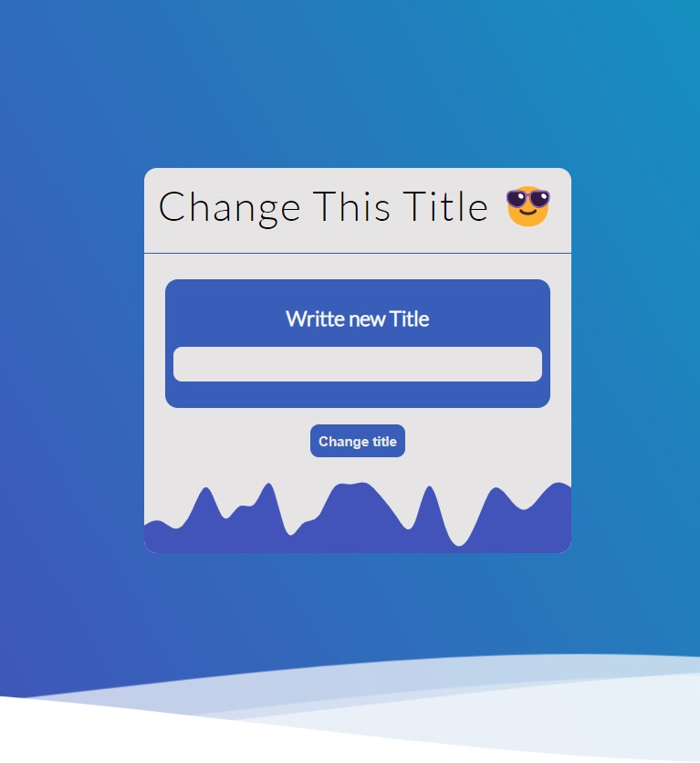

# Welcome! 👋 Communication between child and parent challenge

## The challenge

Users should be able to:

- write a new title to the input (found in the child file)
- press the "change title" button and the change is reflected in the title
- if the button is pressed with empty input or with double spaces (" ") the title should change to: "Change This Title 😅"

### Extra points

- when the "change title" button is pressed, the input should be empty ("")
- when "Enter" is pressed the title should be updated.

### Hint

You only have to modify the files: child and parent
